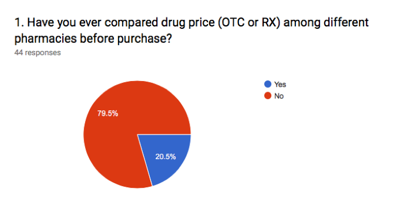
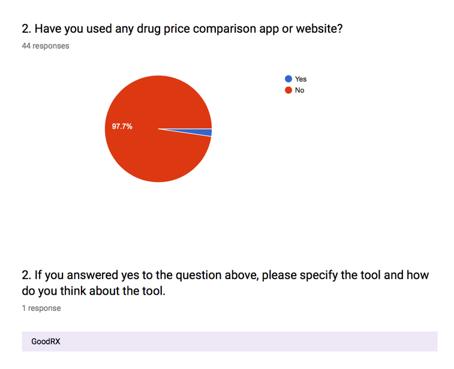
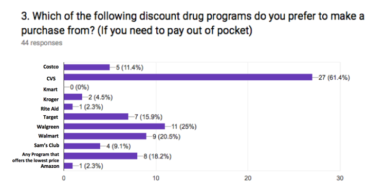
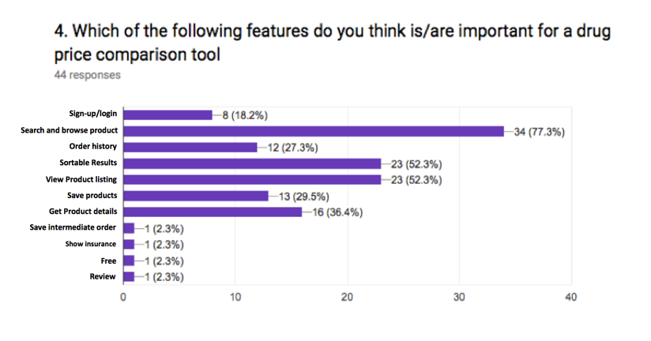
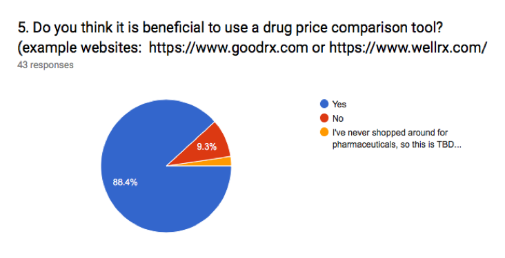

# Drug Price Comparison App Background Survey

**Author**: Team Health Hacker

### Survey
In order to understand our users’ needs, we did a survey on drug price comparison tool. This survey was taken by 44 participants who are current OMSCS (online Master of Science in Computer Science) students. There are five multiple-choice or short-answer questions around topics such as drug price comparison experience, preferred pharmacy choice, tool feature preference and beneficial or not. All survey questions and responses are shown in the figures below

### Results
Based on participants’ response:

* Only 20.5% people have compared drug price before
* Among these people, only one person has used a price comparison tool
* CVS ,Walgreen and Walmart are the top three pharmacy choices. People are also willing to find the pharmacy that offers the lowest price
* “Searching and browsing product”, “sorting results” and “viewing product list” are the top preferred features we need to consider
* Even though, most participants have little or no experience on comparing drug price, 88.4% people are still positive and believe it’s beneficial to use a drug price comparison tool

