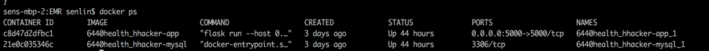

# Special Instructions

## Table of Contents

* [Project Highlights](#project-highlights)
* [Run Application via Docker](#run-application-via-docker)
* [Run Application via Flask](#run-application-via-flask)
* [Clean and Dockerize](#clean-and-dockerize)
* [Limitations](#limitations)
* [Others](#others)

## Project Highlights
* __Flask application:__ implementations of frontend and backend enable interaction among the database, frontend requests, and FHIR server.
* __MySQL database:__ a persistent database that includes user information, drug information, medication price, and search history.
* __FHIR server:__ the application can retrieve real-time Medication Statement of a patient from FHIR server.

## Run Application via Docker
Docker technology enables cross-platform deployment for the Flask application and MySQL database. More specifically, ```./Dockerfile``` defines the built environment for the Flask application. ```./app/db/.Dockerfile``` defines the version and the initial state of the database. ```./docker-compose.yml``` instantiates previous two Docker images via creating two Docker containers, and then defines the relationship of two containers.

1. Navigate to the project directory, and run the command ```docker-compose up```.
1. Access the site via [http://localhost:5000](http://localhost:5000).

## Run Application Locally
1. Run the command ```mysql -u root -p``` to connect with MySQL server.
2. From mysql, run the following commands to create the database.
```
CREATE database cs6440
CREATE USER 'cs6440'@'localhost' IDENTIFIED BY 'cs6440'
GRANT ALL PRIVILEGES ON *.* TO 'cs6440'@'localhost'
```
3. Navigate to the project directory, and run following commands to set up virtual environment and start the application.
```
sudo pip install virtualenv
virtualenv venv
source venv/bin/activate
pip install -r requirements.txt
export FLASK_APP=run.py
flask initdb
flask run
```
4. Access the website via [http://127.0.0.1:5000/](http://127.0.0.1:5000/).


## Clean and Dockerize

### Delete Docker Container and Image, and Re-run the Application
1. Run the command ```docker ps -a```.
1. Locate _CONTAINER IDs_ for the following two images: __6440health_hhacker-app__ and __6440health_hhacker-mysql__.

1. Run the command ```docker stop <CONTAINER ID for 6440health_hhacker-app>``` and ```docker stop <CONTAINER ID for 6440health_hhacker-mysql>``` to stop two previous images.
1. Run ```docker rm <CONTAINER ID for 6440health_hhacker-app>``` and ```docker rm <CONTAINER ID for 6440health_hhacker-mysql>``` to delete each container.
1. Run the command ```docker rmi $(docker images -q)``` to delete all images.
1. Once the containers and images are deleted, run the command ```docker-compose up --build -d``` to build and run the Docker images.
1. Access the website via [http://localhost:5000](http://localhost:5000).


### Delete Docker Container Only, and Re-run the Application
1. Run the command ```docker ps -a```.
1. Locate _CONTAINER IDs_ for the following two images: __6440health_hhacker-app__ and __6440health_hhacker-mysql__.

1. Run the command ```docker stop <CONTAINER ID for 6440health_hhacker-app>``` and ```docker stop <CONTAINER ID for 6440health_hhacker-mysql>``` to stop two previous images.
1. Run ```docker rm <CONTAINER ID for 6440health_hhacker-app>``` and ```docker rm <CONTAINER ID for 6440health_hhacker-mysql>``` to delete each container.
1. Once the containers are deleted, run the command ```docker-compose up``` to create containers and run the Docker images.
1. Access the website via [http://localhost:5000](http://localhost:5000).

## Limitations
### User Requiment
Dr. Pervaiz would like to see the effective period of patients' medications in Med History Page. However, unfortunately, we cannot realize this function at the moment. This is because we implement a real-time connection with public test server, and the server does not provide any information about effective period and medication start/end date. In the future, we may satisfy this requirement by using our own server. 

### Drugs in Database
1. We've searched for 4 largest online pharmacy websites: CVS, Walmart, Walgreen and Goodrx. Except for CVS, all the others provide
API that can connect to their data. However, we are not able to gain full access or obtain the data we want. As a result, We decided to collect a small set of sample data manually
to support the function of our website first. In the future, we might collect drug price using data crawling. 
2. Currently, user can find the lowest price of the following drugs in different forms, dosages and quantities:

| Drug Name |
|:-----|
| aspirin, zolpidem, terbinafine, metformin, citalopram, losartan/hydrochlorothiazide, buspirone, insulin glargine, naproxen, metformin, prednisone, omeprazole, salbutamol, carvedilol, simvastatin, beclomethasone dipropionate, Codeine Phosphate, Lithium Bromide, Trichothecenes, Sodium Iodipamide  |

3. If user searches for other drugs, a message "Sorry, we don’t have information for this medication" will be shown.

### FHIR Patients in Database
Three patients have been added to our database for test purpose. Their information can also be found on the hapifhir server.

| Fhir ID | Email | Birthday | Password | First Name | Middle Name | Last Name |
|:--|:-----|:-----|:-----|:-----|:-----|:-----|
| 2005252 | test1@gatech.edu | 1950-07-30 | 123 | Archie | | Wang |
| 2032860 | test2@gatech.edu | 1893-07-15 | 123 | Brandon | | Ferguson |
| 2032861 | test3@gatech.edu | 1897-10-15 | 123 | John | | Doe |


## Others
Before running the application, please make sure FHIR server is up and running.
